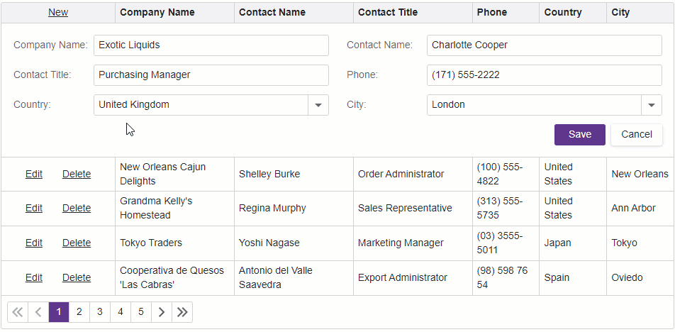

<!-- default badges list -->

<!-- default badges end -->
# Grid for Blazor - How to implement cascading combo boxes

This example demonstrates how to implement cascading combo boxes in the edit form of the [DevExpress Blazor Grid](https://docs.devexpress.com/Blazor/403143/grid) component.

In the example, the Grid's edit form displays the **Country** and **City** cascading [combo boxes](https://docs.devexpress.com/Blazor/DevExpress.Blazor.DxComboBox-2). The **Country** combo box is bound to a constant list of countries, while the **City** combo box gets its data from a dynamically generated list of cities based on the selected country. Values of the combo boxes correspond to the edit model's `Country` and `City` fields.

Once you change the [Value](https://docs.devexpress.com/Blazor/DevExpress.Blazor.DxComboBox-2.Value) of the **Country** combo box, its [ValueChanged](https://docs.devexpress.com/Blazor/DevExpress.Blazor.DxComboBox-2.ValueChanged) event occurs. The event handler assigns the new value to the edit model's `Country` field and sets the `City` field value to `null`. The example code generates a list of the cities in the selected country and assigns the list to the [Data](https://docs.devexpress.com/Blazor/DevExpress.Blazor.DxComboBox-2.Data) property of the **City** combo box.

## Files to Look At

- [Index.razor](./CS/Pages/Index.razor)
- [Program.cs](./CS/Program.cs)
- [NorthwindContext.cs](./CS/Models/NorthwindContext.cs)
- [Supplier.cs](./CS/Models/Supplier.cs)
- [WorldCitiesContext.cs](./CS/Models/WorldCitiesContext.cs)
- [City.cs](./CS/Models/City.cs)
- [Country.cs](./CS/Models/Country.cs)

## Documentation

- [Cascading Combo Boxes](https://docs.devexpress.com/Blazor/DevExpress.Blazor.DxComboBox-2#cascading-comboboxes)
- [Grid - Edit Data and Validate Input](https://docs.devexpress.com/Blazor/403454/grid/edit-data-and-validate-input)

## More Examples

- [Bind the Grid to data with Entity Framework Core](https://github.com/DevExpress-Examples/blazor-dxgrid-bind-to-data-with-entity-framework-core)
- [Create a Foreign Key (ComboBox) Column](https://github.com/DevExpress-Examples/blazor-grid-foreignkey-column)
